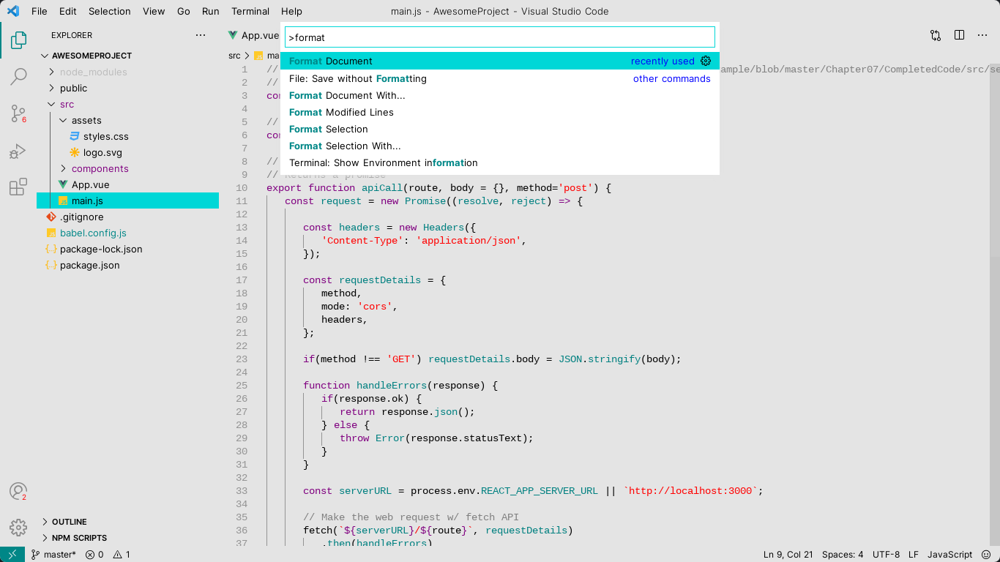

  

<h1 align="center">
  Capitola
</h1>
<h3 align="center">
  At the beach, life is different.
</h3>

  Capitola is a minimalist light theme with a gray background, terminal colors, and a beach vibe from the 90s. It's all about bringing joy and simplicity to your code.

## Screenshots

### VSCode

### JetBrains (PyCharm, IntelliJ, etc.)

## Installation

* [JetBrains](https://plugins.jetbrains.com/plugin/18983-capitola-color-scheme/)
* [VSCode](https://marketplace.visualstudio.com/items?itemName=vitornovictor.capitola)

## Versions

* [iTerm2](https://github.com/VitorNoVictor/capitola/blob/main/iterm2/Capitola.itermcolors)
* [JetBrains](https://github.com/VitorNoVictor/capitola/blob/main/jetbrains/Capitola.icls)
* [VSCode](https://github.com/VitorNoVictor/capitola/blob/main/vscode/themes/capitola-color-themes.json)

## Contributing

Pull requests are welcome. For major changes, please open an issue first to discuss what you would like to change.

## License
[MIT](https://choosealicense.com/licenses/mit/)

  

